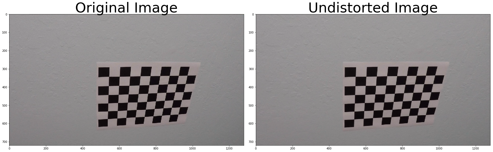
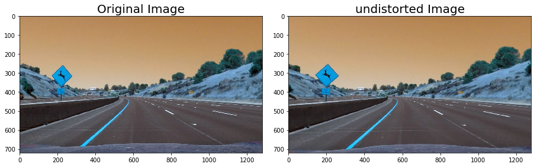
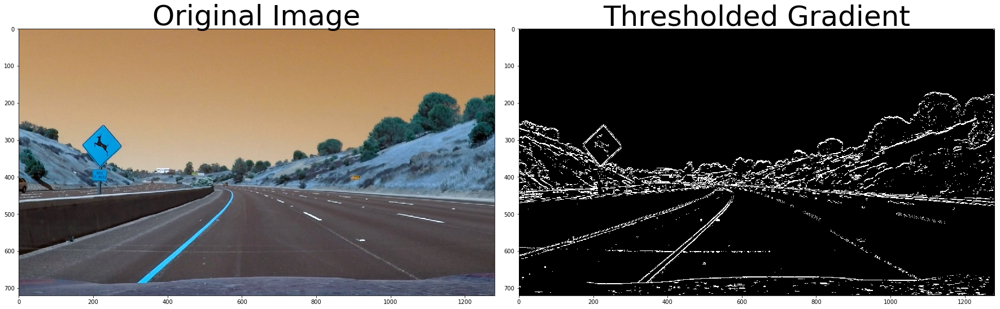
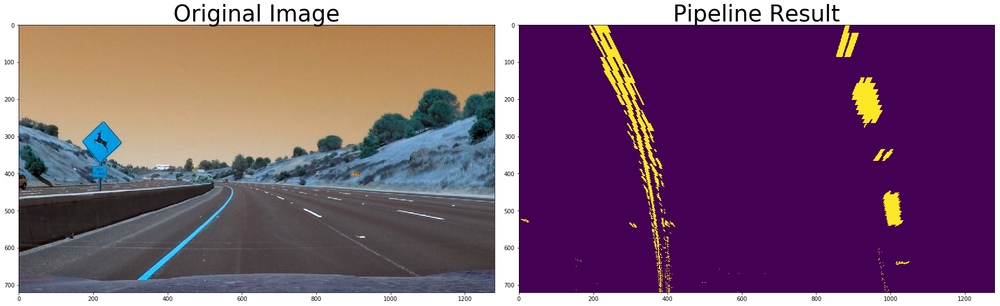
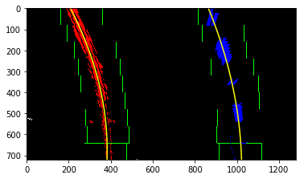
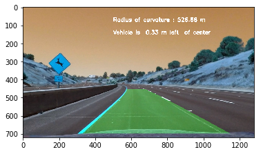

## Writeup

---

**Advanced Lane Finding Project**

The goals / steps of this project are the following:

* Compute the camera calibration matrix and distortion coefficients given a set of chessboard images.
* Apply a distortion correction to raw images.
* Use color transforms, gradients, etc., to create a thresholded binary image.
* Apply a perspective transform to rectify binary image ("birds-eye view").
* Detect lane pixels and fit to find the lane boundary.
* Determine the curvature of the lane and vehicle position with respect to center.
* Warp the detected lane boundaries back onto the original image.
* Output visual display of the lane boundaries and numerical estimation of lane curvature and vehicle position.

## [Rubric](https://review.udacity.com/#!/rubrics/571/view) Points

- [ ] [writeup](writeup.md)
- [ ] [code](advanced_lanes.ipynb)
- [ ] [example output images](https://github.com/veegit/CarND-Advanced-Lane-Lines/tree/master/output_images)
- [ ] [output video](./output_video/project_video.mp4)

### Here I will consider the rubric points individually and describe how I addressed each point in my implementation.  

---

### Writeup / README

#### 1. Provide a Writeup / README that includes all the rubric points and how you addressed each one.  

[writeup](writeup.md)

### Camera Calibration

#### 1. Briefly state how you computed the camera matrix and distortion coefficients. Provide an example of a distortion corrected calibration image.

The following steps were taken to calculate the distortion

1. findChessBoardCorners which took the camera images provided and then drew the corners on chess board and returned the mapping from 3d points to 2d points

````
def find_chessboard_corners(images, save_image=False):
    # prepare object points, like (0,0,0), (1,0,0), (2,0,0) ....,(6,5,0)
    objp = np.zeros((nx*ny,3), np.float32)
    objp[:,:2] = np.mgrid[0:nx,0:ny].T.reshape(-1,2)

    # Arrays to store object points and image points from all the images.
    objpoints = [] # 3d points in real world space
    imgpoints = [] # 2d points in image plane.

    # Step through the list and search for chessboard corners
    for fname in images:
        img = cv2.imread(fname)
        gray = cv2.cvtColor(img,cv2.COLOR_BGR2GRAY)

        # Find the chessboard corners
        ret, corners = cv2.findChessboardCorners(gray, (9,6),None)

        # If found, add object points, image points
        if ret == True:
            objpoints.append(objp)
            imgpoints.append(corners)

            # Draw and display the corners
            img = cv2.drawChessboardCorners(img, (9,6), corners, ret)
            if (save_image == True):
                cv2.imwrite('output_images/camera_cal/'+fname.split('/')[1], img)

    return objpoints, imgpoints
````
Here is the sample images where the corners have been drawn


2. Once the mapping is returned, the following code returned the matrix and distortion coefficients using the CV library's `calibrateCamera` method.

````
def calibrate(img, objpoints, imgpoints):
    ret, mtx, dist, rvecs, tvecs = cv2.calibrateCamera(objpoints, imgpoints, (img.shape[1],img.shape[0]), None, None)
    return (mtx, dist)
````
Note: the img parameter is only passed to retrieve the width and height of image

3. The coefficients were then used to undistort the any image which was passed to below method
````
def undistort(img, Mtx=mtx, Dist=dist):
    undist = cv2.undistort(img, Mtx, Dist, None, Mtx)
    return undist
````
Here is the output for a sample camera image



---

### Pipeline (single images)

#### 1. Provide an example of a distortion-corrected image.


#### 2. Describe how (and identify where in your code) you used color transforms, gradients or other methods to create a thresholded binary image.  Provide an example of a binary image result.

Once an image was provided, following transformations were performed on cell 5
1. sobel operator
2. calculating magnitude of threshold
3. calculating direction of threshold

After playing with different thresholds, I used the same thresholds as in assignment
````
gradx = abs_sobel_thresh(image, orient='x', thresh=(20, 100))
grady = abs_sobel_thresh(image, orient='y', thresh=(20, 100))
mag_binary = mag_threshold(image, sobel_kernel=ksize, mag_thresh=(30, 100))
dir_binary = dir_threshold(image, sobel_kernel=ksize, thresh=(0.7, np.pi/2))
combined = np.zeros_like(dir_binary)
combined[((gradx == 1) & (grady == 1)) | ((mag_binary == 1) & (dir_binary == 1))] = 1
````
This resulted in following binary image



#### 3. Describe how (and identify where in your code) you performed a perspective transform and provide an example of a transformed image.

I used the following color transformation and then did perspective transform

````
def color_gradient(image):
    # Choose a Sobel kernel size
    ksize = 5 # Choose a larger odd number to smooth gradient measurements

    # Apply each of the thresholding functions
    red_channel = image[:, :, 0]
    red_equalized = cv2.equalizeHist(red_channel)
    red_binary = np.zeros_like(red_equalized)
    red_binary[(red_equalized > 250) & (red_equalized <= 255)] = 1
    gradx = abs_sobel_thresh(red_channel, orient='x', sobel_kernel=ksize, thresh=(30, 255))
    
    combined_binary = np.zeros_like(red_channel)
    combined_binary[(red_binary == 1) | (gradx == 1)] = 1
    return combined_binary
````
grad_img = color_gradient(undistorted)
warped_grad_img, _ = warp_perspective(grad_img)

The perspective transformation was performed on the following source windows (src) for the output destination window (dst)
````
src = np.float32([[220,700],[595,450],[685,450],[1070,700]])
dst = np.float32([[320,720],[320,-100],[960,-100],[960,720]])
````
Used the following repo as a reference to come to the conclusion for the source and destination points
[LINK](https://github.com/jayasim/CarND-Advanced-Lane-Lines-P4/blob/master/AdvancedLaneDetection.ipynb)

For the color transform, I used the red channel from RGB since HLS was working well on test images but somehow it was creating issues on video (see below). Moreover after looking at slack channel for project, I realized performing `equalizeHist` on the channel will work well on images with a shadow.

I played with some values and landed on `(250,255)` and `(30, 255)` for color/gradient thresholds.

This resulted on following image


#### 4. Describe how (and identify where in your code) you identified lane-line pixels and fit their positions with a polynomial?

See the below dropdown code which uses the `find_lanes` code from project video in udacity. The code identifies the points `(x,y)` on the left and right lanes. 

<details/>
  <summary>Expand this Code</summary>

````
def find_lanes(binary_warped):
    # Assuming you have created a warped binary image called "binary_warped"
    # Take a histogram of the bottom half of the image
    hist_h = int(binary_warped.shape[0]/2)
    histogram = np.sum(binary_warped[hist_h:,:], axis=0)
    # Create an output image to draw on and  visualize the result
    out_img = np.dstack((binary_warped, binary_warped, binary_warped))*255
    # Find the peak of the left and right halves of the histogram
    # These will be the starting point for the left and right lines
    midpoint = np.int(histogram.shape[0]/2)
    leftx_base = np.argmax(histogram[:midpoint])
    rightx_base = np.argmax(histogram[midpoint:]) + midpoint

    # Choose the number of sliding windows
    nwindows = 9
    # Set height of windows
    window_height = np.int(binary_warped.shape[0]/nwindows)
    # Identify the x and y positions of all nonzero pixels in the image
    nonzero = binary_warped.nonzero()
    nonzeroy = np.array(nonzero[0])
    nonzerox = np.array(nonzero[1])
    # Current positions to be updated for each window
    leftx_current = leftx_base
    rightx_current = rightx_base
    # Set the width of the windows +/- margin
    margin = 100
    # Set minimum number of pixels found to recenter window
    minpix = 50
    # Create empty lists to receive left and right lane pixel indices
    left_lane_inds = []
    right_lane_inds = []

    # Step through the windows one by one
    for window in range(nwindows):
        # Identify window boundaries in x and y (and right and left)
        win_y_low = binary_warped.shape[0] - (window+1)*window_height
        win_y_high = binary_warped.shape[0] - window*window_height
        win_xleft_low = leftx_current - margin
        win_xleft_high = leftx_current + margin
        win_xright_low = rightx_current - margin
        win_xright_high = rightx_current + margin
        # Draw the windows on the visualization image
        cv2.rectangle(out_img,(win_xleft_low,win_y_low),(win_xleft_high,win_y_high),
        (0,255,0), 2) 
        cv2.rectangle(out_img,(win_xright_low,win_y_low),(win_xright_high,win_y_high),
        (0,255,0), 2) 
        # Identify the nonzero pixels in x and y within the window
        good_left_inds = ((nonzeroy >= win_y_low) & (nonzeroy < win_y_high) & 
        (nonzerox >= win_xleft_low) &  (nonzerox < win_xleft_high)).nonzero()[0]
        good_right_inds = ((nonzeroy >= win_y_low) & (nonzeroy < win_y_high) & 
        (nonzerox >= win_xright_low) &  (nonzerox < win_xright_high)).nonzero()[0]
        # Append these indices to the lists
        left_lane_inds.append(good_left_inds)
        right_lane_inds.append(good_right_inds)
        # If you found > minpix pixels, recenter next window on their mean position
        if len(good_left_inds) > minpix:
            leftx_current = np.int(np.mean(nonzerox[good_left_inds]))
        if len(good_right_inds) > minpix:        
            rightx_current = np.int(np.mean(nonzerox[good_right_inds]))

    # Concatenate the arrays of indices
    left_lane_inds = np.concatenate(left_lane_inds)
    right_lane_inds = np.concatenate(right_lane_inds)

    # Extract left and right line pixel positions
    leftx = nonzerox[left_lane_inds]
    lefty = nonzeroy[left_lane_inds] 
    rightx = nonzerox[right_lane_inds]
    righty = nonzeroy[right_lane_inds] 
    
    return (leftx, lefty, rightx, righty, out_img)
````

</details>


The returned left and right lane points are plotted onto a curve as below.
````
left_fit = np.polyfit(lefty, leftx, 2)
right_fit = np.polyfit(righty, rightx, 2)
````

This returns the following image




#### 5. Describe how (and identify where in your code) you calculated the radius of curvature of the lane and the position of the vehicle with respect to center.

The following section of the code calculates the radius and offset

````
ym_per_pix = 30/h # meters per pixel in y dimension
xm_per_pix = 3.7/700 # meters per pixel in x dimension
y_eval = np.max(ploty)
def find_curvature_in_m(x, y, xmpp=xm_per_pix, ympp=ym_per_pix, ye=y_eval):
    # Fit new polynomials to x,y in world space
    fit_cr = np.polyfit(y*ympp, x*xmpp, 2)
    # Calculate the new radii of curvature
    curverad = ((1 + (2*fit_cr[0]*ye*ympp + fit_cr[1])**2)**1.5) / np.absolute(2*fit_cr[0])
    return curverad

def find_offset_in_px(fit):
    offset = -w/2+fit[0]*h**2 + fit[1]*h + fit[2]
    return offset

def find_offset_in_m(fit):
    return find_offset_in_px(fit) * xm_per_pix
````

the method `find_curvature_in_m` takes in `(x,y)` points for the lane and calculates the radius by calculating first and second derviative of the curve.

The method `find_offset_in_m` takes in the fitted polynomial  and then calculates the offset by filling the equation Ay^2+ By + C where A,B,C are the coefficients of the fitted polynomial and y=height of the window from bottom margin

This is a sample output

````
Curvatures:  429.468782769 m 623.855582913 m
Offsets:  -1.36269116265 m 2.01823614132 m
````

The values are averaged to get the final radius and offset

#### 6. Provide an example image of your result plotted back down onto the road such that the lane area is identified clearly.

Once the lanes have been determined, the image in unwarped from 2d to 3d using the following method

````
def unwarp(img, undistorted, left_fit, right_fit, Ploty=ploty):
    left_fitx = left_fit[0]*ploty**2 + left_fit[1]*ploty + left_fit[2]
    right_fitx = right_fit[0]*ploty**2 + right_fit[1]*ploty + right_fit[2]
    
    # Create an image to draw the lines on
    warp_zero = np.zeros_like(img).astype(np.uint8)
    color_warp = np.dstack((warp_zero, warp_zero, warp_zero))

    # Recast the x and y points into usable format for cv2.fillPoly()
    pts_left = np.array([np.transpose(np.vstack([left_fitx, Ploty]))])
    pts_right = np.array([np.flipud(np.transpose(np.vstack([right_fitx, Ploty])))])
    pts = np.hstack((pts_left, pts_right))

    # Draw the lane onto the warped blank image
    cv2.fillPoly(color_warp, np.int_([pts]), (0,255, 0))

    # Warp the blank back to original image space using inverse perspective matrix (Minv)
    Minv = cv2.getPerspectiveTransform(dst, src)
    newwarp = cv2.warpPerspective(color_warp, Minv, (w,h)) 
    # Combine the result with the original image
    result = cv2.addWeighted(undistorted, 1, newwarp, 0.3, 0)
    return result
````

This returns the following image where we superimpose the curvature and offset



---

### Pipeline (video)

#### 1. Provide a link to your final video output.  Your pipeline should perform reasonably well on the entire project video (wobbly lines are ok but no catastrophic failures that would cause the car to drive off the road!).

Here's a [link to my video result](./output_video/project_video.mp4)

To do fast lane caclulation, the implementation interchanged between basic `find_lanes` method and faster `find_lanes_fast` method below which takes in already fitted lanes from previous frames

<details/>
  <summary>Expand this Code</summary>
  
  ````
  def find_lanes_fast(binary_warped, left_fit, right_fit):
    # Assume you now have a new warped binary image 
    # from the next frame of video (also called "binary_warped")
    # It's now much easier to find line pixels!
    nonzero = binary_warped.nonzero()
    nonzeroy = np.array(nonzero[0])
    nonzerox = np.array(nonzero[1])
    margin = 100
    left_lane_inds = ((nonzerox > (left_fit[0]*(nonzeroy**2) + left_fit[1]*nonzeroy + left_fit[2] - margin)) 
                      & 
                      (nonzerox < (left_fit[0]*(nonzeroy**2) + left_fit[1]*nonzeroy + left_fit[2] + margin))) 

    right_lane_inds = ((nonzerox > (right_fit[0]*(nonzeroy**2) + right_fit[1]*nonzeroy + right_fit[2] - margin)) 
                       & 
                       (nonzerox < (right_fit[0]*(nonzeroy**2) + right_fit[1]*nonzeroy + right_fit[2] + margin)))  

    # Again, extract left and right line pixel positions
    leftx = nonzerox[left_lane_inds]
    lefty = nonzeroy[left_lane_inds] 
    rightx = nonzerox[right_lane_inds]
    righty = nonzeroy[right_lane_inds]
    return (leftx, lefty, rightx, righty) 
  
  ````
  
</details>


This is the code which switches to a faster implementation

````
    if (left.detected):
        leftx, lefty, rightx, righty = find_lanes_fast(warped_grad_img, left.current_fit, right.current_fit)
    else :
        leftx, lefty, rightx, righty, out_img = find_lanes(warped_grad_img)
        left.detected = True
    
    left_fit = np.polyfit(lefty, leftx, 2)
    right_fit = np.polyfit(righty, rightx, 2)
    left.current_fit = left_fit
    right.current_fit = right_fit
````

---

### Discussion

#### 1. Briefly discuss any problems / issues you faced in your implementation of this project.  Where will your pipeline likely fail?  What could you do to make it more robust?

Some problems which I was facing was around
1. HLS color space, it was working fine on test images but was veering off the roads on a shadowed frame from the video. Prolly averaging the polynomials out would help in correctly finding the lanes
2. Close to the bottom of the screen the lanes were inward i.e. they were not exactly on the lane markings, see the following image below. I think this can be improved by having more windows to explore in `find_lanes` method

3. The pipeline would fail on very dark shadows and also if there are vehicles on the lane. 
